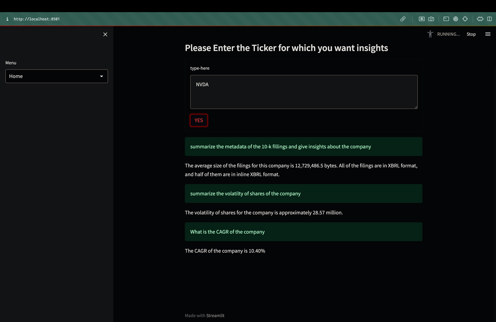
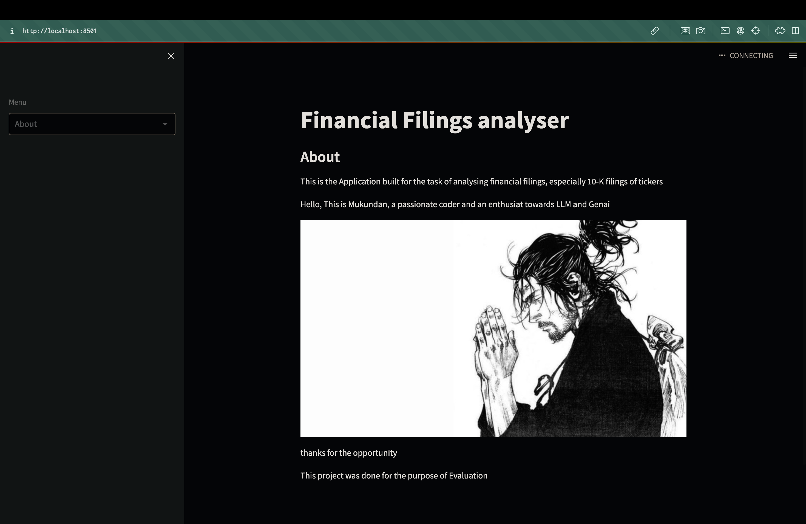
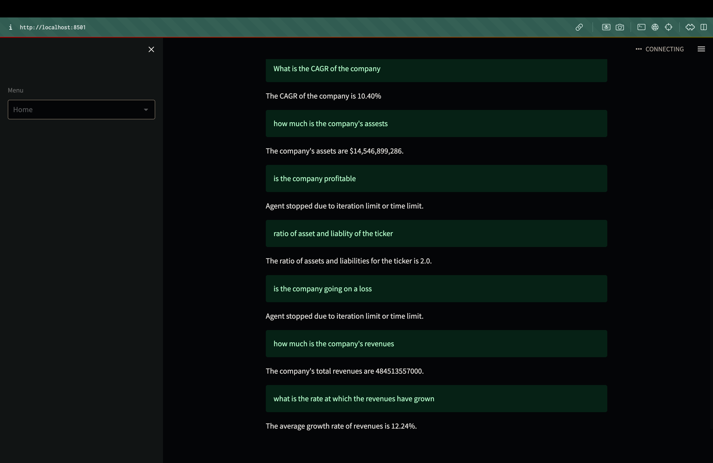

# Financial_Statement_Analyser

## Project Overview

This project is dedicated to financial filings and analysis, employing a comprehensive approach that involves data retrieval, dataset creation, and analysis using the powerful OPENAI model (GPT-3.5-TURBO). The project aims to provide valuable insights into financial data for informed decision-making.

### Running the Project Locally

To run the project on your local machine, follow these steps:

1. Begin by cloning the repository using `git clone`.
2. Execute `streamlit run main.py` in your terminal to launch the project.
3. Create a `.env` file and store your OPENAI API key for access.

## Design and Choices

The project's design and choices encompass a structured workflow:

1. Dataset creation involves fetching CIK values and obtaining 10k filing metadata using ticker symbols.
2. Extracted facts from the filings include essential financial metrics such as assets, revenue, and shares.
3. Selection of key metrics crucial for financial analysis.
4. Transformation of data into pandas dataframes for efficient manipulation.
5. Leveraging the OPENAI model for generating valuable insights.
6. Utilization of Litellm for project simplicity and flexibility.
7. Individual querying of datasets due to token limitations for optimal results.

## Results

The project delivers insightful visualizations and analysis based on the processed financial data, enhancing understanding and decision-making.

### Visual Results

## Problems Faced and Future Work

The project encountered challenges that pave the way for future improvements:

1. Implementation hurdles in achieving LRU caching for datasets to enhance speed and latency.
2. Token limitations hindering the consolidation of datasets for comprehensive analysis.

## Acknowledgements

Special thanks to the Georgia Tech Fintech Lab for providing the opportunity to contribute to this impactful project.

This detailed documentation provides a thorough insight into the project's objectives, methodology, challenges faced, and avenues for future enhancements.
